# Hockley Woods

Hockley Woods is a picturesque woodland located in Essex, England. As one of the largest surviving areas of ancient woodland in the region, it boasts a diverse ecosystem and an abundance of wildife. Visitors can often spot a variety of its wildlife including deer, foxes, birds, and small mammals. Its scenic trials and pathways offer opportunities for leisurely walks, family picnics, and other outdoor activities and sports, making it a popular location for families, wildlife enthusiasts, outdoor adventurers and anyone looking for an escape from urban life as Hockley Woods offers a great chance to reconnect with nature's wonders.

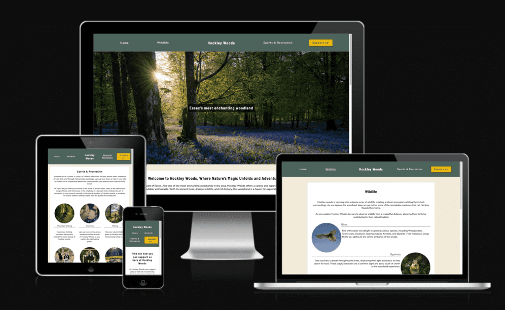

## Contents

[Planning](https://github.com/RadleighSmith/hockley-woods#planning)

[Features](https://github.com/RadleighSmith/hockley-woods#features)

[Testing](https://github.com/RadleighSmith/hockley-woods#testing)

[Deployment](https://github.com/RadleighSmith/hockley-woods#deployment)

[Languages](https://github.com/RadleighSmith/hockley-woods#languages)

[Media](https://github.com/RadleighSmith/hockley-woods#media)

[Credits](https://github.com/RadleighSmith/hockley-woods#credits)

[Thank You](https://github.com/RadleighSmith/hockley-woods#thank-you)

## Planning

### Target Audience:
 
 The Hockley Woods website has been designed to cater several of different target audiences these include:

 * Families

 * Nature enthusiasts

 * Outdoor adventures

 * Dog walkers

 * Runners

 * Hikers

 * Cyclists

 ### Website Aim:

My site aim is to inform local and outside visitors of what Hockley Woods has to offer. I would like visitors to be able to seamlessly navigate around my site whilst being informed of useful information from wildlife to different types of activities that are permitted inside the woods. Whilst achieving this I want to express the important points of enjoying everything on offer whilst remaining respectful to the wildlife, environment and other visitors.

### Colour Scheme:

With the site being designed around nature, I decided early on that I wanted the website to use natural colours, Nothing that would distract the user away from the information but a scheme that clearly depicted that it was designed with the colours of nature in mind.

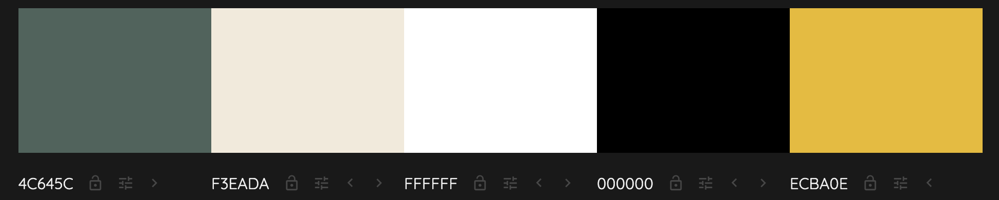

I used http://colormind.io/ to design my colour scheme. I decided to use green (#4c645c) on the header and footer to keep it consistent with white (#ffffff) to contrast against this. I used the slightly off-white (#f3eada) to add a contrasting background and give the impression of depth while the site's information is on the white (#ffffff) background. I used the yellow (#ecba0e) colour on the header to contrast against the green (#4c645c) header to make the support us button stand out to users. 

My goal was to make the site accessible to all, I used https://contrast-grid.eightshapes.com/ to check that my colours contrasted against each other.

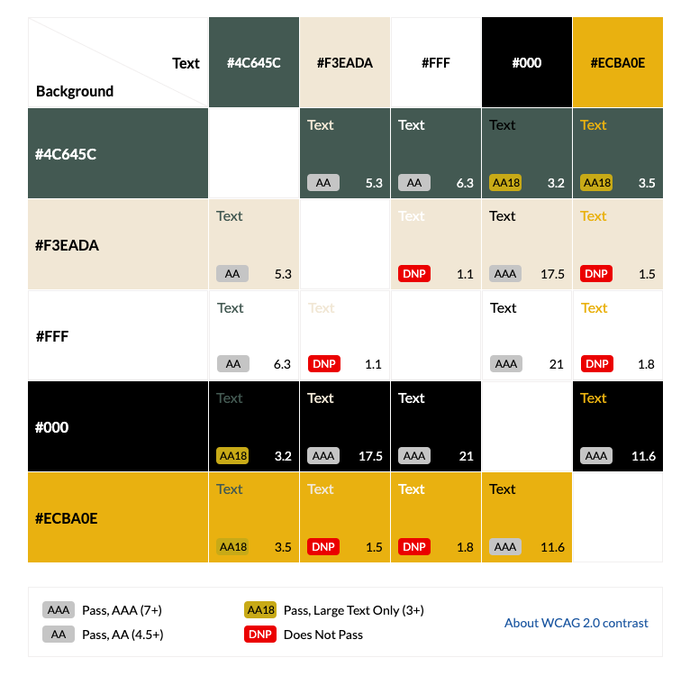

### Typography

Throughout the site I used two different fonts.

* Barlow Semi Condensed: Barlow is a slightly rounded, low-contrast, grotesk type family. I used this for section headings.

* Nunito: Nunito is a well balanced, highly-readable sans-serif typeface. I used this for the main body of text.

These fonts were improted to the stylesheet via Google Fonts

## Features

### The Header

The header element is a static element, It is the primary navigation tool for the site. With links to the home, Wildlife, Sports & Recreation, and Support Us! pages. Within my wireframes I originaly designed the title to be above the nav bar. 

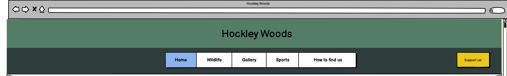

However, I decided against this early on when designing the site as I belived that it would leave to much unused space on the top section. Using flexbox I decided to have the title placed central with the links either side.

I added the active attribute to aid users in which page they are on and also the hover attribute to the header to give users a positive response.

I wanted to ensure that my site could be accessed by multiple device types and screen sizes. So using media quires I have ensure that the header remains clear and useable down to atleast 320px width.

#### Tablet:

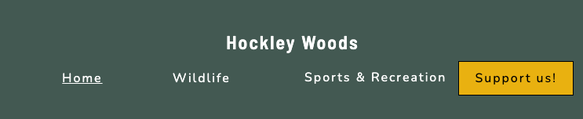

#### Mobile:

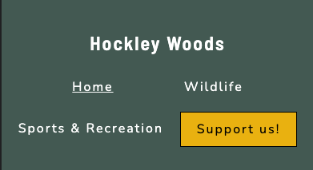

### Home Page

#### Hero Image and Text

I have used a hero image only on the home page to welcome visitors, I have done this to add to the user experience and overall visual appeal. As the hero image is the first thing visitors will see when landing on my site it needed to be relevant while also grabbing their attention immediately, encouraging them to explore further. 

I also used hero text to spark curiosity with users to want to dive deeper into the website. I used contrasting colours with an RGBA background to add transparency so it didn't take complete focus from the hero image itself.

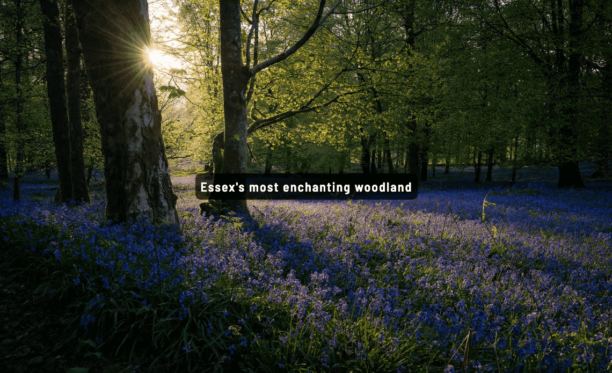

#### Home page content

The home page excluding the hero image and text is split into 4 sections. Starting with the welcome paragraph and image, this section is focused on inviting the visitor into the website giving a basic overview of Hockley Woods. In this I have include a picture of a woodland during a sunrise, and some basic facts about the woods. I have used information from the local council here and they are credited below. 

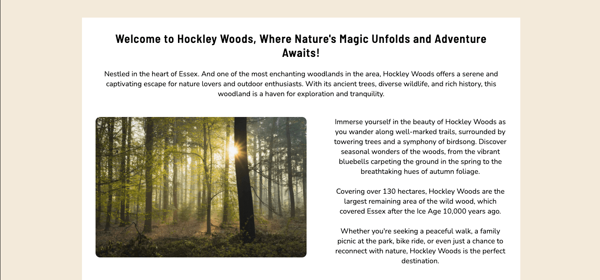

The next section is a quote, I have used this to space the page out so the user isnt overwhelmed with information. 

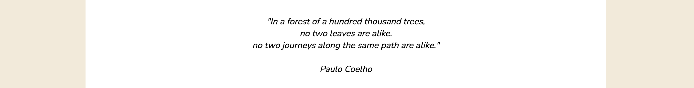

The next section is a quote, I have used this to space the page out so the user isn't overwhelmed with information. 

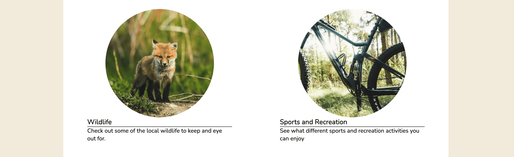

The last section of the home page before the footer is the 'How to find us' section this includes an interactive google maps, Address, and basic directions from main roads and public transport. I originally planned for this to have its own page but decided that it would be best situated on the home page.

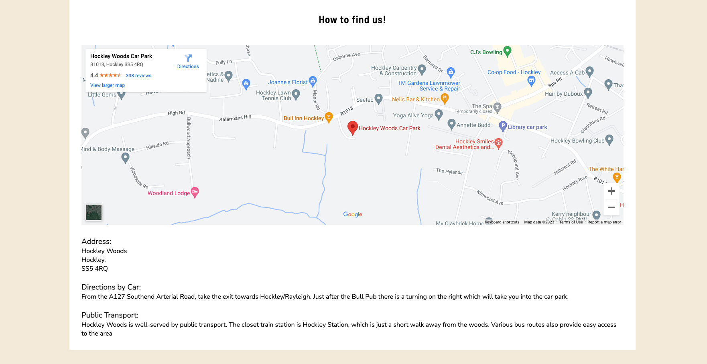

### Wildlife Page

The wildlife page has been designed for visitors who are interested in what they may find whilst visiting the woods. It includes a opening paragraph and a sentence on keeping respectful to the wildlife, I originally planned for the sentence to be placed at the bottom of the page after visitors had read all the content. However, I decided that I wanted this to be above so it cannot be missed as this is one of my aims for the site.

The page has been designed with a flexbox grid with images placed in the small columns and the text in the large columns, using this design made it very easy to add media queries to scale the content for smaller screens. Screens that are 750px wide or less the content will be aligned to the middle with the pictures located above the text.

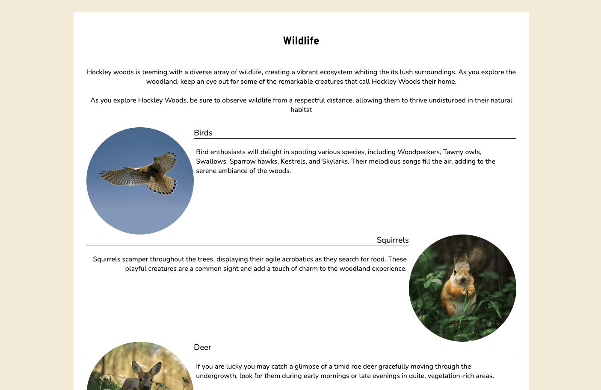

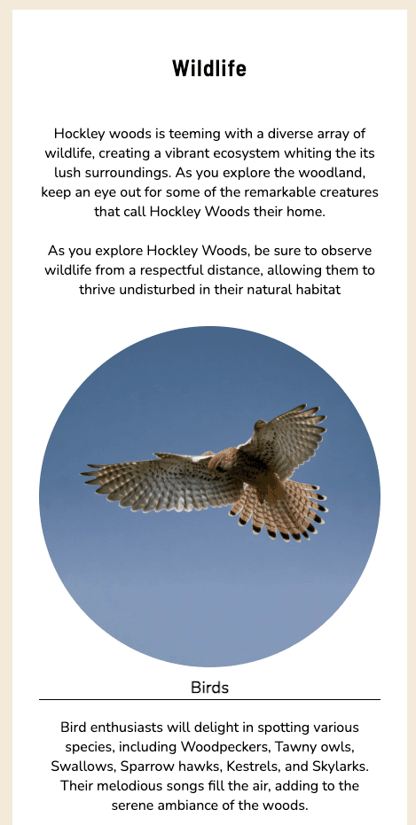

### Sports and Recreation Page

The Sports & Recreation page has been designed for visitors who may be interested in different activities around the woods, it opens with an opening paragraph which is a basic summary of some of the activities. The second part of the page was designed with a flexbox grid which goes into more detail about each of the activities on offer. This page scales very similarly to the wildlife page with screens 630px or smaller.

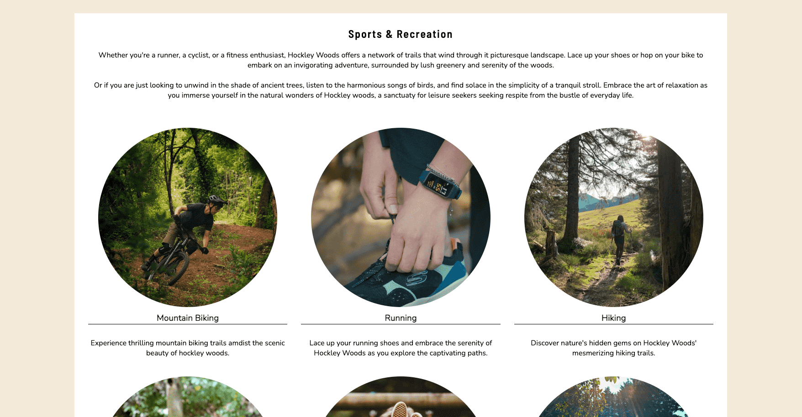

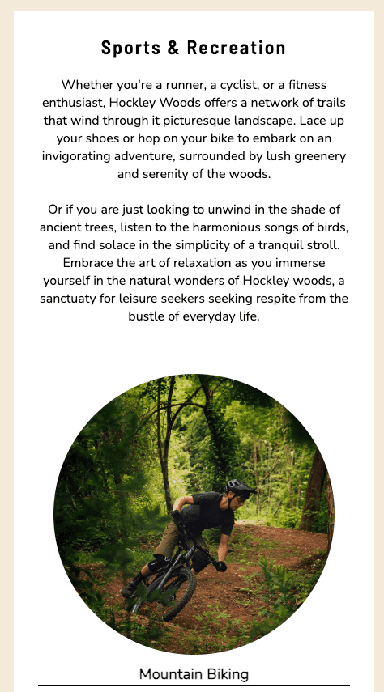

### Support us! Page

The support us page informs visitors in a way they could support us, it also includes a form in which users will leave their first and last name along with an email, where we can get in touch personally. I currently have used the code institute landing page to show that it works. However, shortly, I hope to add some back-end structure to the site so this works correctly.

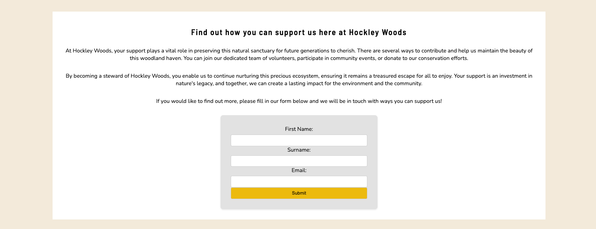

### Footer

The footer which is found at the bottom of each page, is used to host our social media links to Facebook, Twitter, Youtube and Instagram. It also holds an education declaration.

### Future Features

* Interactive Gallery / Photography Page - Allow users to upload images creating a sense of ownership and pride among the community.

* Clubs Page - Allow Clubs to promote themselves to further engage the community and encourage participation

* Condence the header into a drop-down menu when in mobile view

* History Page - Showcase the historical importance of Hockley Woods.

## Testing

Throughout Development I have tested the site rigorously by using the following devices and applications:

* Macbook Pro 13" Safari, - Chrome and Firefox

* Windows PC (Windows 11) on a 1440p 27" monitor - Chrome, Firefox and Edge

* iPad Air (5th Gen) - Safari and Chrome

* iPad Pro (4th Gen) - Safari and Chrome

* iPhone 13 Pro Max - Safari and Chrome

* iPhone 11 - Safari and Chrome

* Samsung Galaxy Fold - Chrome 

I made use of Google Chrome dev tools to allow to me emulate other devices not a my disposal, I also was able to test it in the responsive dimension in real-time.

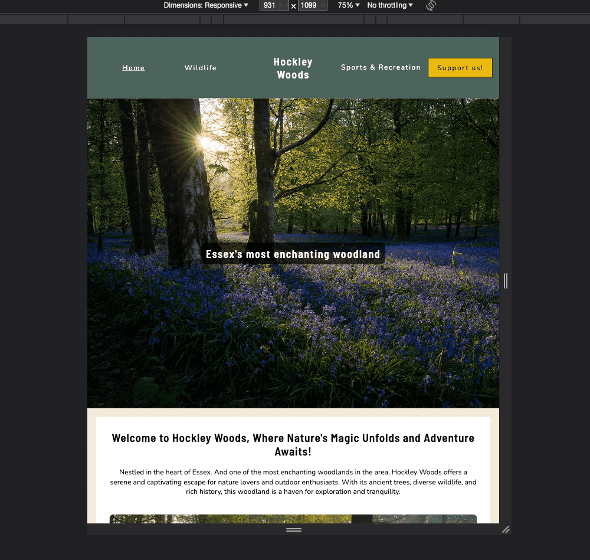

### Lighthouse

When pushing the website through the lighthouse extension I was getting an error with my Map as it was missing a title giving me a score of 97 on my accessibility.

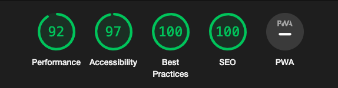

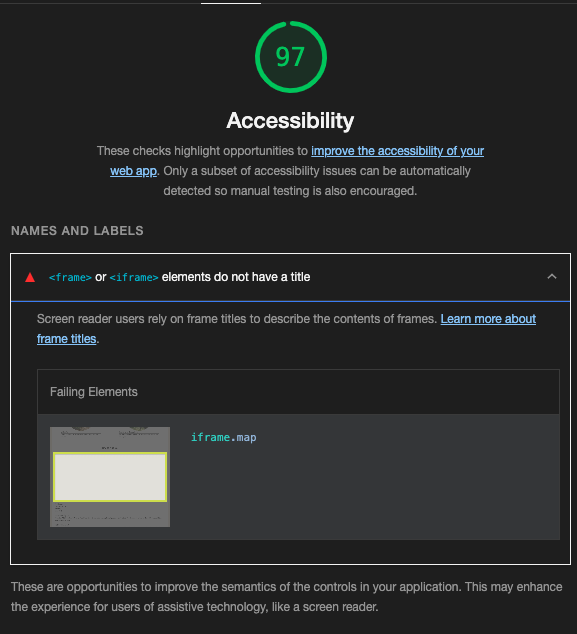

However, after adding a title attribute to the map this error was cleared.

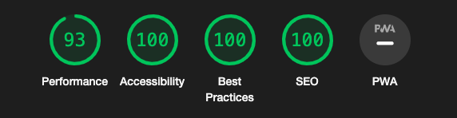

### Bugs

* Fixed an issue where all the media queries stoped working due to a typo on the 750px query where the max-width measurement was spelt rpx instead of px.

### Unfixed Bugs

There are no current known bugs present within the site, However, I have left this section for cataloguing and for fixing future bugs.

## Languages

The coding languages used to create this site were HTML and CSS.

## Deployment

I deployed the site on GitHub Pages using the following method:

1. From my project [repository](https://github.com/RadleighSmith/hockley-woods), navigate to the settings tab.

2. From the left-hand menu, select the pages option.

3. From the source section drop-down menu, select the Main Branch.

4. Once the main Branch has been selected, A message will appear and indicate a successful deployment to GitHub pages. A link will also be provided to the site.

Please find the live site via this URL - [Hockley Woods Live Website](https://radleighsmith.github.io/hockley-woods/index.html)

## Media

I used [Unsplash](https://unsplash.com/) website to get the majority of the images used in this project. 

Please find a list of all the images used with their respective owner.

| Image |  Image Credit |
| ------------- | ------------- |
| [hero-image.jpg](assets/images/hero-image.jpg) | [Click and Learn Photography](https://unsplash.com/@clickandlearnphotography) |
| [woodland.jpg](assets/images/woodland.jpg) | [Joyce G](https://unsplash.com/@joyce_) |
| [sports-link.jpeg](assets/images/sports-link.jpeg) | [Quenten Janssen](https://unsplash.com/@quenten10) |
| [wildlife-link.jpeg](assets/images/wildlife-link.jpeg)  | [Jeremy Hynes](https://unsplash.com/@hyneseyes) |
| [birds.jpg](assets/images/birds.jpg)  | [Erik van Dijk](https://unsplash.com/@erikvandijk) |
| [squirrel.jpg](assets/images/squirrel.jpg)  | [Andrey Svistunov](https://unsplash.com/@svistal13) |
| [deer.jpg](assets/images/deer.jpg)  | [Yann Lerjen](https://unsplash.com/@ylerjen) |
| [foxes.jpg](assets/images/foxes.jpg)  | [Jeremy Hynes](https://unsplash.com/@hyneseyes) |
| [critters.jpg](assets/images/critters.jpg)  | [Lukas Seitz](https://unsplash.com/@lukasseitz) |
| [instects.jpg](assets/images/insects.jpg)  | [Heather Wilde](https://unsplash.com/@heather_wilde) |
| [mountain-bike.jpg](assets/images/mountain-bike.jpg)  | [Tim Foster](https://unsplash.com/@timberfoster) |
| [running.jpg](assets/images/running.jpg)  | [Onur Binay](https://unsplash.com/@onurbinay) |
| [hiking.jpg](assets/images/hiking.jpg) | [Stéphane Fellay](https://unsplash.com/@fins) |
| [dogs.jpg](assets/images/dogs.jpg)  | Myself - Radleigh Smith  |
| [swing.jpg](assets/images/swing.jpg) | [Annie Spratt](https://unsplash.com/@anniespratt)  |
| [picnic.jpg](assets/images/picnic.jpg)  | [Jennie Clavel](https://unsplash.com/@ohpeach_33)  |

All photos have been used within [Unsplash's Licence](https://unsplash.com/license)

I used [Optimizilla](https://imagecompressor.com/) to compress the image sizes.

I also used [Simple Image Resizer](https://www.simpleimageresizer.com/) to resize images while keeping their aspect ratio.

## Credits

###  Content

* The hover and active CSS classes are inspired by Code Institue's Love Running Project.

* Some information on the home page was taken from the [Rochford Council Website](https://www.rochford.gov.uk/hockley-woods)

* The form on the site is inspired by the Code Institute's Coders Coffeehouse code-along project.

* I learnt the basics of Flexbox by using the "flex-test" provided to me by my Code Institute mentor Richard Wells.

* All social media icons used on the site were sourced from [Font Awesome](https://fontawesome.com)

* I used [ChatGBT](https://chat.openai.com/) to help populate some of the information across the site.

* Fonts used across the site are from [Google Fonts](https://fonts.google.com/)

### Thank You

* Code Institute

    I must say a thank you to the entire Code Institute team for inspiring me to pursue my dreams of becoming a full-stack software developer. Through the well presented lessions and their continued support, I truly appriciate everything they do.

* Richard Wells - Code Institute Mentor.

    I feel extremely fortunate to have Richard mentoring me through the course, it has been quite overwhelming at times but his continued support has kept me on track and focused in the areas that need it most. I am truly grateful for his help.

* My Girlfriend Ciara

    Without her support from the very start giving me as much time as I need. Your support has been unbelievable and I thank you from the bottom of my heart.
