# Hockley Woods

Hockley Woods is a picturesque woodland located in Essex, England. As one of the largest surviving areas of ancient wodland in the region, it boasts a diverse ecosystem and an abundance of wlldife. Visitors can often spot a variety of its wildlife including deer, foxes, birds, and small mammals. Its scenic trials and pathways offer opportunities for leisurly walks, family picnics, and other outdoor activities and sports, making it a popular locaton for families, wildlife enthusiasts, outdoor adventureres and anyone looking for an escape from urban life as hockley woods offers a great chance to reconnect with nature's wonders.

## Contents

## Planning

### Target Audience:
 
 The Hockley Woods website has been designed to cater for a number of different target audiences these include:
 * Families
 * Nature enthusiasts
 * Outdoor adventures
 * Dog walkers
 * Runners
 * Hikers
 * Cyclists

 ### Website Aim:

 The aim of my site is to inform local and outside visitiors of what Hockley Woods has to offer. I would like visitiors to be able to seamlessly navigate around my site whislt being informed of useful information from wildlife to different types of activities that is permitted inside the woods. Whilst achiving this I want to express the important points of enjoying everything on offer whilst remaining respectful to the wildlife, environment and other visitors.

### Colour Scheme:

With the site being designed around nature, I decided early on that I wanted the website to use natural colours, Nothing that would distract the user away from the information but a scheme that clearly depicted that it was designed with the colours of nature in mind.

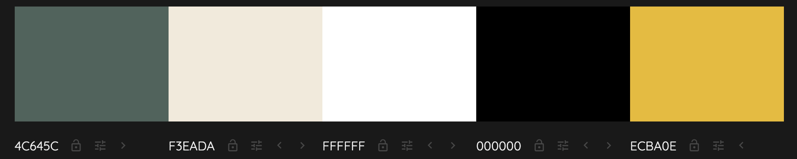

I used http://colormind.io/ to design my colour scheme. I decided to the use green (#4c645c) on the header and footer to keep it consistant with white (#ffffff) to contrast against this. I used the slightly off white (#f3eada) to add a contrasting background and give the impression on depth while the sites information is on the white (#ffffff) background. I used the yellow (#ecba0e) colour on the header to contrast againt the green (#4c645c) header to make the support us button stand out to users. 

My goal was to make the site as accessible to all, I used https://contrast-grid.eightshapes.com/ to check that my colours contrasted against each other.

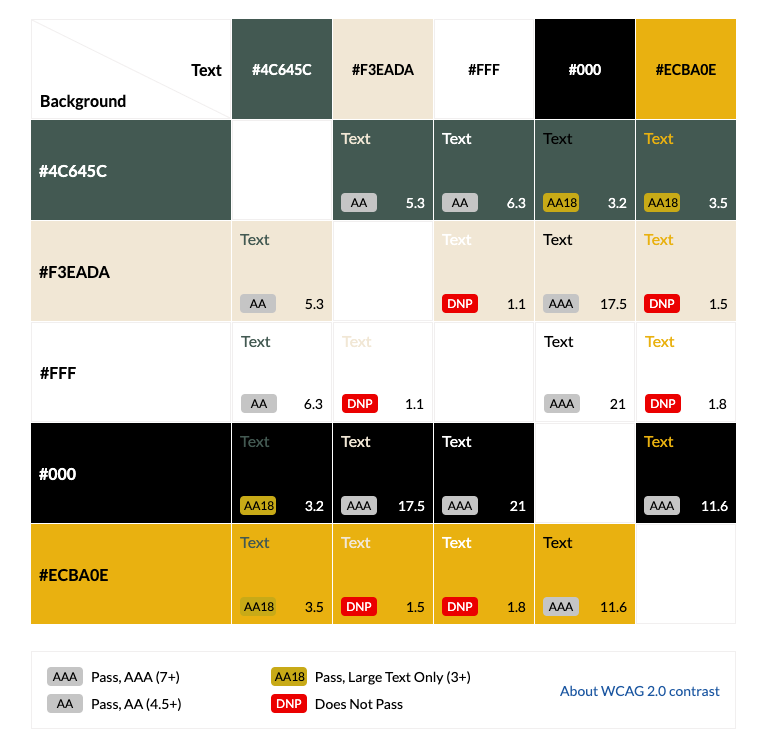

## Features

### The Header

The header element is a static element, It is the primary navigation tool for the site. With links to the home, Wildlife, Sports & Recreation, and Support Us! pages. Within my wireframes I originaly designed the title to be above the nav bar. 

However, I decided against this early on when designing the site as I belived that it would leave to much unused space on the top section. Using flexbox I decided to have the title placed central with the links either side.

I added the active attribute to aid users in which page they are on and also the hover attribute to the header to give users a positive response.

I wanted to ensure that my site could be accessed by multiple device types and screen sizes. So using media quires I have ensure that the header remains clear and useable down to atleast 320px width.

#### Tablet:

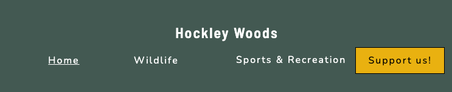

#### Mobile:

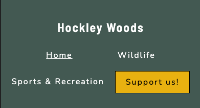

### Home Page

#### Hero Image and Text

I have used a hero image only on the home page to welcome visitors, I have done this to add to the user experience and overall visual appeal. As the hero image is the first thing visitors will see when landing on my site it needed to be relevant while also grabbing their attention immediately, encouraging them to explore further. 

I also used hero text to spark curiosity with users to want to dive deeper into the website. I used contrasting colours with a RGBA background to add transparency so it didn't take complete focus from the hero image itself.

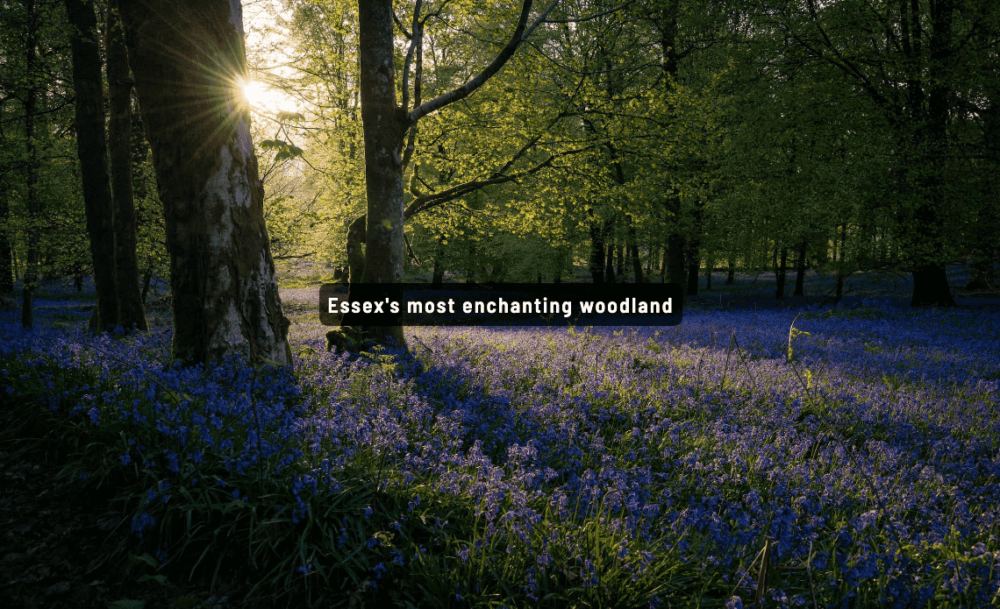

#### Home page content

The home page excluding the hero image and text is split into 4 sections. Starting with the welcome paragraph and image, this section is focused on inviting the visitor into the website giving a basic overview of Hockley Woods. In this I have include a picture of a woodland during a sunrise, and some basic facts about the woods. I have used information from the local council here and they are credited below. 

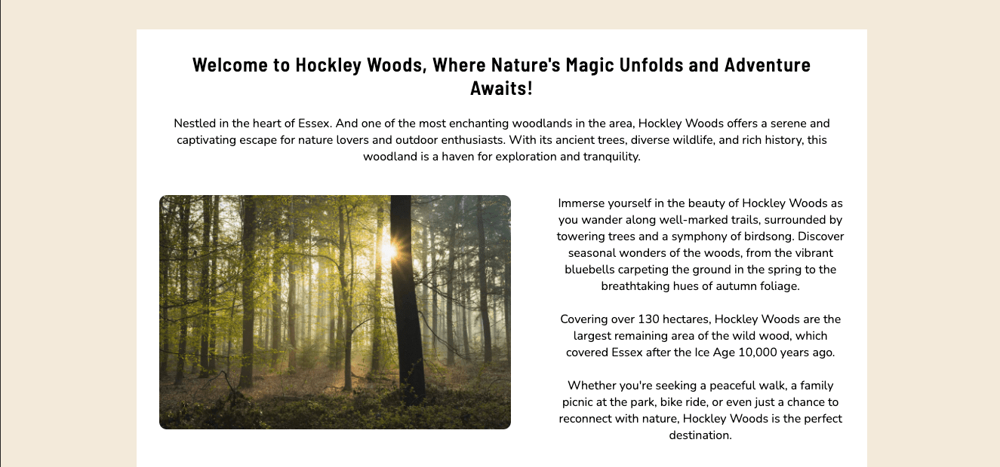

The next section is a quote, I have used this to space the page out so the user isnt overwhelmed with information. 

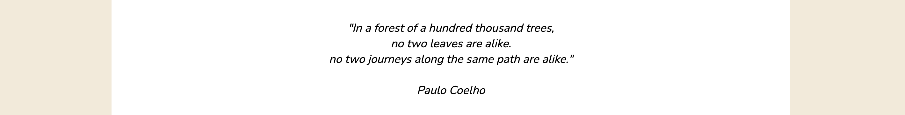

The next section is some aditional links, the reason I have added these is because the user is now at as stage of wanting the find out more information, and insead of scrolling to the top I have directed them after they already now know a little information about the woods from the content above.

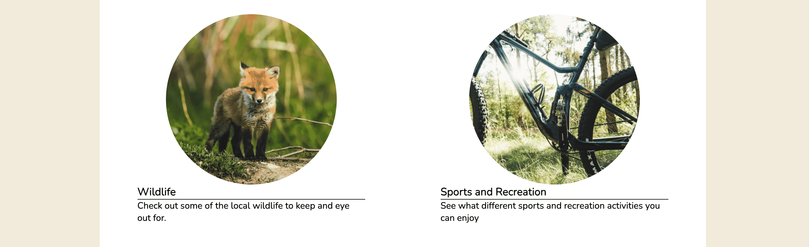

The last section of the home page before the footer is the 'How to find us' section this include an interactive google maps, Address, and basic directions from main roads and public transport. I originally planed for this to have its own page but decided that it would be best situated on the home page.

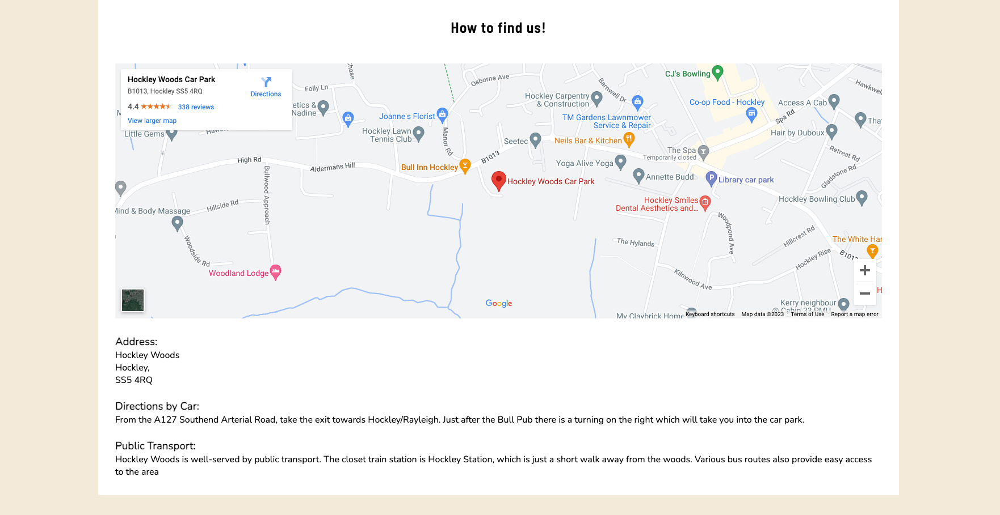

### Wildlife Page

The wildlife page is has been designed for visitors who are intrested on what they may find whilst visiting the woods. It include a opening paragraph and a sentence on keeping respectful to the wildlife, I originally planned for the sentence to be place at the bottom of the page after visitors had read all the content. However, I decided that I wanted to this to be above so it cannot be missed as this is one of my aims for the site.

The page has been designed with a flexbox grid with images placed in the small columns and the text in the large columns, using this design made it very easy to add media queries in to scale the content for smaller screens. Screens that are 750px wide or less the content will be aligned to the middle with the pictures located above the text.

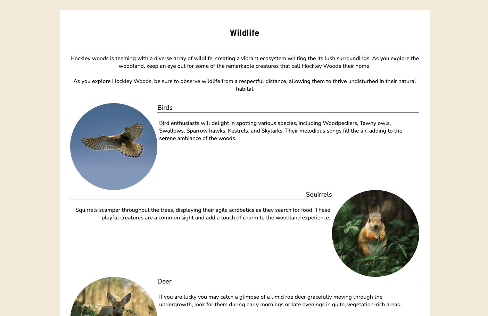

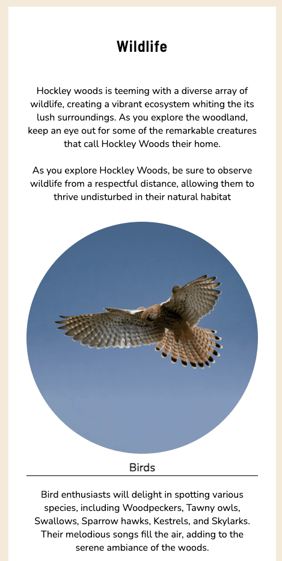

### Sports and Recreation Page

The Sports & Recreation page has been designed for visitors who may be intrested in different activites around the woods, it opens with a opening paragraph which is a basic summary of some of the activties. The second part of the page was designed with a flexbox grid which goes into more detail about each of the activities on offer. This page scales very simmilarly to the wildlife page with screens 630px or smaller.

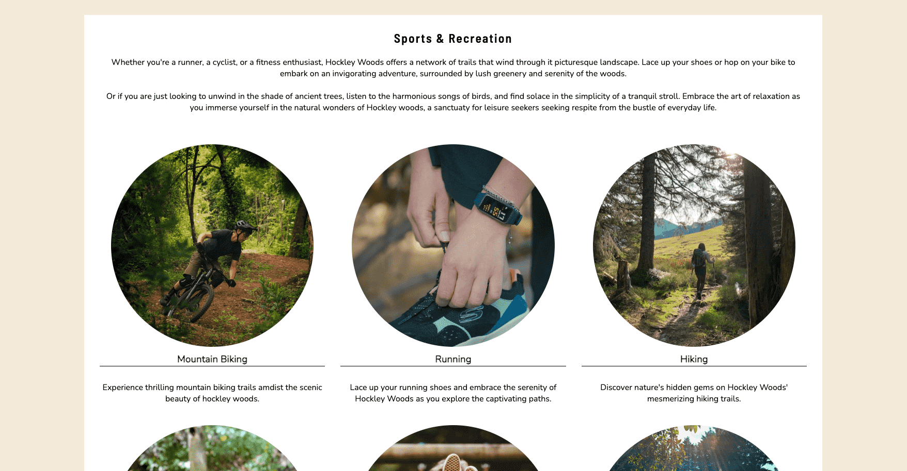

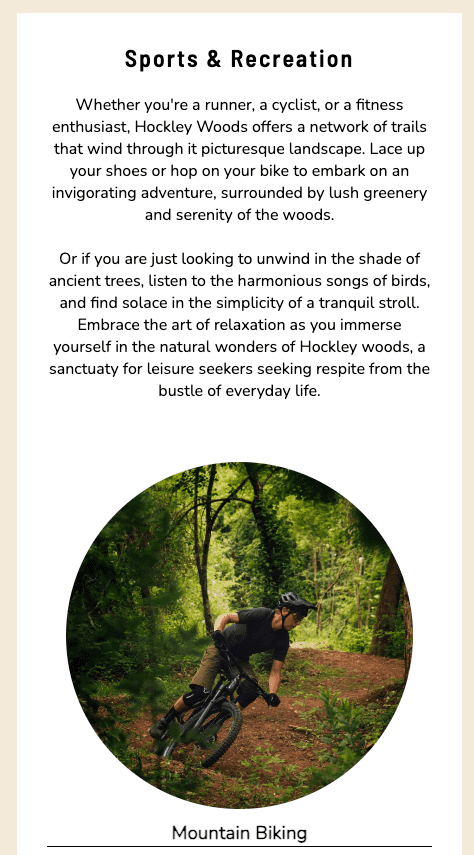

### Support us! Page

The support us page informs visitors in way they could support us, it also include a form in which users will leave their first and last name along with an email, where we can get in touch personally with them in way they can support the woods at this time.

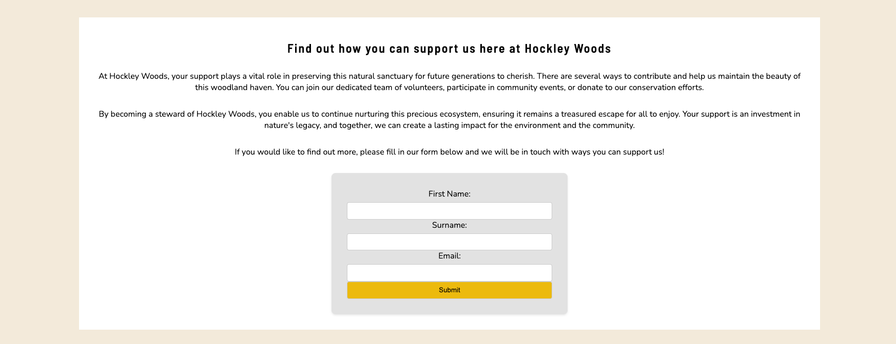

### Footer

The footer which is found at the bottom of each page, is used to host our social media links to Facebook, Twitter, Youtube and Instagram. It also hold an education declaration.

### Future Features

* Interactive Gallery / Photography Page - Allow users to upload images creating a sense of ownership and pride among the community.
* Clubs Page - Allow Clubs to promote themsleves to futher engage the community and encourage participation
* Condence the header into a drop down menu when in mobile view
* History Page - Showcase the historical importance of Hockley Woods.

## Testing

Throughout Development I have tested the site rigorously by using the following devices and aplications:

* Macbook Pro 13" Safari, - Chrome and Firefox
* Windows PC (Windows 11) on a 1440p 27" monitor - Chrome, Firefox and edge
* Ipad Air (5th Gen) - Safari and Chrome
* Ipad Pro (4th Gen) - Safari and Chrome
* Iphone 13 Pro Max - Safari and Chrome
* Iphone 11 - Safari and Chrome

I made use of Google chromes dev tools to allow to me emulate other devices not a my disposal, I also was able to test it in the responsive dimesion in real-time.

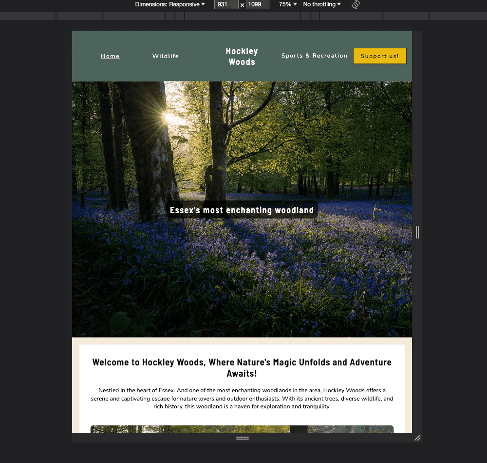

### Lighthouse

When pushing the website through the lighthouse extension I was getting an error with my Map as it was missing a title giving me a score of 97 on my accesibility.

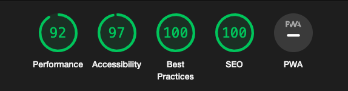

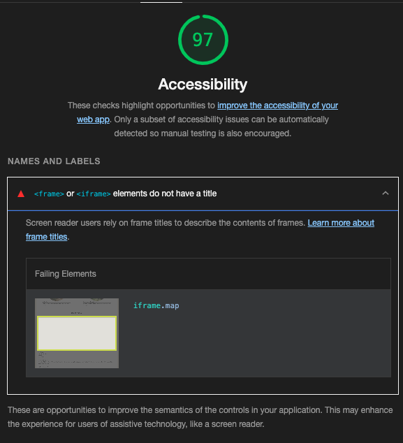

However after adding a title attribute to the map this error was cleared.

## Deployment

## Credits

